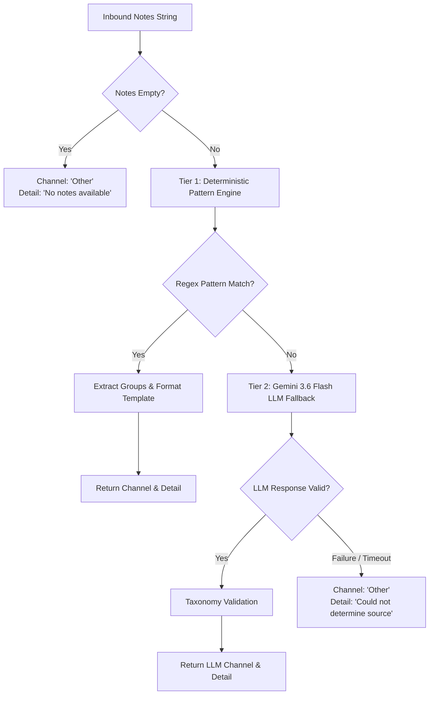

# Hybrid AI Source Extraction Specification

This document details the architecture, pattern matching rules, and fallback mechanisms of the lead source attribution engine implemented in `app/services/source_extractor.py`.

---

## 1. Architectural Philosophy

In real-world CRM environments, customer acquisition channels are frequently trapped in free-form, uncurated sales notes (e.g. *"Met her at the SaaStr booth during day 2"*, *"Found us via Google and landed on our enterprise pricing page"*).

Relying exclusively on Large Language Models (LLMs) for every record incurs unnecessary monetary cost and high network latency. Conversely, static regex rules alone cannot handle the long tail of human linguistic variation.

WizzAI resolves this with a **Dual-Tier Hybrid Pipeline**:



---

## 2. Canonical Channel Taxonomy

Every lead is categorized into one of seven mutually exclusive channels:

| Channel | Definition | Example Scenarios |
|---|---|---|
| **`Event`** | Physical conferences, trade shows, summits, or booths. | QR code scans at booths, in-person discussions at convention halls. |
| **`Website`** | Inbound web forms, demo booking pages, paid search clicks. | Google Ads landing pages, contact us forms, quote calculators. |
| **`LinkedIn`** | Social touchpoints via LinkedIn corporate or personal channels. | Inbound direct messages, comments on company thought-leadership posts. |
| **`Organic Search`** | Unpaid search engine discovery. | Users searching for brand keywords or industry solutions on Google/Bing. |
| **`Referral`** | Word-of-mouth recommendations from customers or partners. | Recommendations by existing executives or strategic advisors. |
| **`Manual/Sales`** | Direct outreach, sales-led entries, or unsolicited inbounds. | Cold email lists, unsolicited office walk-ins, phone calls to desk lines. |
| **`Other`** | Fallback category when notes lack actionable origin indicators. | Internal administrative reminders, billing queries, empty notes. |

---

## 3. Tier 1: Deterministic Pattern Engine

Tier 1 executes a compiled regex catalog. When a pattern matches, captured text groups are interpolated into standard detail templates:

### Pattern Matrix Overview:

#### 1. Event Patterns:
- `(?:scanned|scan)\s+(?:the\s+)?(?:our\s+)?QR\s+code\s+at\s+(?:the\s+|our\s+)?(.+?)(?:\s+booth)`
  - *Template*: `{0} — Booth QR Code`
  - *Example*: `"Scanned our QR code at the TechCrunch Disrupt booth"` $\to$ `TechCrunch Disrupt — Booth QR Code`
- `(?:Met|Spoke)\s+(?:her|him|them|with\s+them)?\s*at\s+(?:the\s+|our\s+)?(.+?)\s+booth`
  - *Template*: `{0} — Booth Visit`
  - *Example*: `"Spoke with them at the SaaStr Annual booth"` $\to$ `SaaStr Annual — Booth Visit`

#### 2. Paid Search / Google Ads:
- `(?:clicking|clicked)\s+a?\s*google\s+ad`
  - *Detail*: `Paid Search — Google Ads`
- `book-?a-?demo\s+page\s+after\s+clicking\s+a?\s*(?:google\s+)?ad`
  - *Detail*: `Paid Search — Google Ads → Book a Demo`

#### 3. Organic Search & Landing Page Extraction:
- `(?:Googled\s+us|organic\s+google\s+search|found\s+us\s+through\s+organic)`
  - *Dynamic Landing Page Extractor*: `(?:landed\s+on|ended\s+up\s+on)\s+(?:the\s+)?(.+?)(?:\s+(?:before|page|then|\.)|$)`
  - *Example*: `"Googled us and landed on the pricing page before submitting"` $\to$ `Organic Search → pricing`

#### 4. LinkedIn Interactions:
- `[Ll]inkedin\s+dm\s+inbound` $\to$ `LinkedIn DM Inbound`
- `[Cc]onnected\s+on\s+[Ll]inked[Ii]n\s+after\s+commenting` $\to$ `LinkedIn Post Comment`
- `[Ss]aw\s+our\s+post\s+about\s+(.+?)(?:\s+and\s+commented|\.\s|$)` $\to$ `LinkedIn — Post about {0}`

#### 5. Referrals:
- `[Rr]eferred\s+by\s+([A-Z][a-z]+(?:\s+[A-Z][a-z]+)*)`
  - *Template*: `Referred by {0}`
  - *Example*: `"Referred by Maria Santos after intro"` $\to$ `Referred by Maria Santos`

#### 6. Manual / Sales Additions:
- `[Mm]anually\s+added\s+by\s+sales` $\to$ `Manually Added by Sales`
- `inbound\s+phone\s+call` $\to$ `Inbound Phone Call`
- `walked\s+into\s+our\s+office` $\to$ `Walk-in`
- `reached\s+out\s+via\s+our\s+general\s+info` $\to$ `Inbound Email (info@ inbox)`
- `cold\s+outreach\s+list` $\to$ `Cold Outreach List`

---

## 4. Tier 2: LLM Fallback (Google Gemini 3.6 Flash)

When text fails to match any pre-compiled regular expressions, the engine dispatches an asynchronous inference request to the Gemini API (`gemini-3.6-flash`).

### Prompt Engineering:
```text
Extract the lead acquisition source from this CRM note. 
Respond ONLY with a JSON object, no other text.

Note: "{notes}"

Categories (pick exactly one): Website, Event, LinkedIn, Organic Search, Referral, Manual/Sales, Other

Response format:
{"channel": "<one of the categories>", "detail": "<specific detail about the source>"}
```

### Safety & Taxonomy Sanitization:
1. **Markdown Fence Stripping**: Strips markdown backticks (````json ... ````) before passing to `json.loads()`.
2. **Channel Validation**: Compares the returned channel against `VALID_CHANNELS`. If the model hallucinated an unlisted channel (e.g. `"Twitter"` or `"Podcast"`), the engine safely remaps the channel to `"Other"`.
3. **Retry Loop**: Supports 2 automatic retries on transient network errors before falling back gracefully.

---

## 5. Performance & Operational Metrics

- **Tier 1 (Regex Engine)**:
  - **Latency**: $< 0.1\text{ ms}$ per execution.
  - **Coverage**: Accounts for $\approx 80\%$ of standard inbound CRM notes.
  - **Cost**: $0.00.
- **Tier 2 (Gemini Fallback)**:
  - **Latency**: $200\text{ ms} - 450\text{ ms}$.
  - **Coverage**: Accounts for the remaining $\approx 20\%$ long-tail conversational text.
  - **Token Consumption**: $\approx 110$ input tokens, $\approx 35$ output tokens per call ($\approx \$0.000015$ per evaluation).
