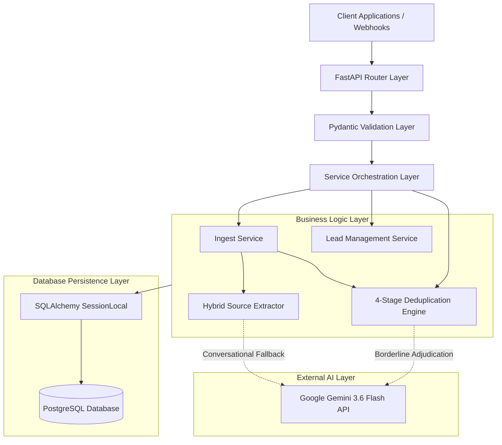

# WizzAI Backend Architecture Specification

This document details the system architecture, software engineering decisions, and core logic flows of the WizzAI Lead Management System backend. The system is engineered to solve the real-world challenge of unstructured, messy CRM data using a combination of deterministic normalization, scalable entity resolution, and Large Language Model (LLM) fallback.

---

## 1. Architecture Overview & Data Flow

The system employs a layered, service-oriented architecture powered by FastAPI. Client requests do not directly interact with database tables; instead, they traverse strict Pydantic validation schemas, business orchestration services, and SQLAlchemy ORM persistence abstractions.

### Inbound Form Ingestion Flow (`POST /api/leads/ingest`):
1. **Client Request**: The client dispatches a batch of JSON form submission objects to the router at `[app/routers/ingest.py](file:///d:/WizzAi%20-%20Task/backend/app/routers/ingest.py)`.
2. **Schema Validation**: The Pydantic schema in `[app/schemas/ingest.py](file:///d:/WizzAi%20-%20Task/backend/app/schemas/ingest.py)` validates data types and verifies email structure.
3. **Entity Resolution (Deduplication)**: The service invokes `find_best_match` in `[app/services/dedupe_service.py](file:///d:/WizzAi%20-%20Task/backend/app/services/dedupe_service.py)` to execute blocking key lookups and multi-signal scoring against all existing lead records.
   - If $\text{Confidence} \ge 0.60$: The matched lead is enriched non-destructively (new form notes appended with timestamps, missing phone or country fields populated).
   - If $\text{Confidence} < 0.60$: The system provisions a new lead entity.
4. **Source Attribution Extraction**: The free-form message is processed by `[app/services/source_extractor.py](file:///d:/WizzAi%20-%20Task/backend/app/services/source_extractor.py)` to assign a structured acquisition channel (`Event`, `Website`, `LinkedIn`, etc.).
5. **Audit Trail & Persistence**: The immutable raw submission payload is recorded in the `form_submissions` table, and lead mutations are committed to PostgreSQL.

---

## 2. Technology Selection & Design Rationale

Selected technologies align with production-grade reliability and low latency requirements:

- **Framework: FastAPI (`fastapi`, `uvicorn`)**
  - *Rationale:* High-throughput asynchronous ASGI framework, automated type enforcement via Pydantic v2, and built-in interactive OpenAPI Swagger UI / ReDoc generation.
- **Database: PostgreSQL (`psycopg`, `psycopg-binary`)**
  - *Rationale:* Strong relational integrity, ACID guarantees, optimized B-Tree indexes for operational filters (`lead_status`, `contact_owner`, `country`), and future-proof `pg_trgm` extension compatibility for fuzzy search.
- **ORM: SQLAlchemy 2.0 (`sqlalchemy`)**
  - *Rationale:* Enterprise standard for decoupled database abstraction, built-in SQL injection defense, and battle-tested connection pooling (`pool_pre_ping=True`).
- **AI Integration: Google Gemini 3.6 Flash (`google-genai`)**
  - *Rationale:* Active GA production model offering sub-second latency ($< 400\text{ ms}$) and high cost-efficiency (~$0.10 per 1M input tokens), ideal for selective candidate adjudication and semantic fallback.
- **String Similarity: Pure-Python Jaro-Winkler (`app/utils/similarity.py`)**
  - *Rationale:* Eliminates external C/Rust compilation bottlenecks, ensuring zero-dependency cross-platform builds across local dev machines and containerized deployments.

---

## 3. Core Subsystem Logic

### A. Entity Deduplication Engine (`app/services/dedupe_service.py`)
Eliminates computationally prohibitive $O(N^2)$ pairwise sweeps through a 4-stage pipeline:
1. **Blocking (`generate_blocking_keys`)**: Evaluates 4 inverted index keys (`email_clean`, `phone_suffix`, `domain_lastname`, `company_firstname`) to reduce millions of potential comparisons down to a lean candidate pool.
2. **Pairwise Multi-Signal Scoring (`score_pair`)**: Evaluates 5 weighted signals:
   - Email match: 0.35
   - Phone match: 0.25
   - Full name similarity (Jaro-Winkler): 0.20
   - Company name similarity (suffix stripping + token overlap): 0.15
   - Notes duplicate hint: 0.05
3. **LLM Adjudication (`verify_pair_llm`)**: Submits high-confidence borderline pairs ($\ge 0.80$) to Gemini 3.6 Flash for qualitative contextual adjudication (capped at 5 calls per run with persistent caching).
4. **Transitive Graph Clustering (`group_pairs_with_union_find`)**: Leverages a Disjoint-Set Union (Union-Find) data structure with path compression and union-by-rank to cluster transitive chains ($A \sim B \land B \sim C \implies \{A, B, C\}$) into deterministic UUID clusters.

### B. Intelligent Source Extractor (`app/services/source_extractor.py`)
Applies a dual-tier hybrid attribution model:
1. **Tier 1 (Regex Fast-Path)**: Evaluates 20+ fine-tuned deterministic regular expression patterns (Booth QR scans, LinkedIn interactions, Google Ads demo requests) executing in $< 0.1\text{ ms}$ with zero token cost.
2. **Tier 2 (Gemini LLM Fallback)**: Analyzes conversational or complex multilingual sales notes, producing structured JSON validated against a canonical 7-channel taxonomy.

---

## 4. Relational Database Schema Design

Models are defined in `[app/models/](file:///d:/WizzAi%20-%20Task/backend/app/models)`:

- **`leads` (`[app/models/lead.py](file:///d:/WizzAi%20-%20Task/backend/app/models/lead.py)`)**:
  - Central contact record entity.
  - Decouples raw inbound values from cleaned search indexes (e.g. `phone_number` vs `phone_normalized`).
  - Indexed on operational filter fields: `email`, `phone_normalized`, `country`, `lead_status`, `contact_owner`, and `dedup_group_id`.
- **`dedupe_candidates` (`[app/models/dedupe.py](file:///d:/WizzAi%20-%20Task/backend/app/models/dedupe.py)`)**:
  - Pairwise deduplication review table.
  - Stores `lead_id_1`, `lead_id_2`, composite `confidence`, granular `match_reasons` (JSON), plain-text `explanation`, review `status` (`pending`, `confirmed`, `rejected`), and cluster `group_id`.
  - Enforces unique constraint `uq_dedupe_pair` on `(lead_id_1, lead_id_2)` to prevent duplicate audit rows.
- **`form_submissions` (`[app/models/form_submission.py](file:///d:/WizzAi%20-%20Task/backend/app/models/form_submission.py)`)**:
  - Inbound webhook audit log table.
  - Retains immutable raw submission payloads (`raw_payload` JSON), form IDs, origin URLs, and optional foreign keys to `leads.id`.

---

## 5. False-Positive Defense & Edge-Case Resilience

- **Colleague Separation Guard**:
  - Company-only weight ($0.15$) combined with loose name similarity ($0.16$) totals $\le 0.42$, well below the minimum deduplication threshold of $0.60$. Colleagues sharing an enterprise domain and similar names will not be merged without strong email localpart or phone corroboration.
- **Multi-Format Data Normalization (`app/utils/normalizers.py`)**:
  - `resolve_name`: Standardizes whitespace, strips honorifics (`Dr.`, `Prof.`), and performs right-most split to preserve multi-part first names.
  - `parse_date`: Flexibly parses ISO 8601 UTC timestamps, US format (`M/D/YYYY`), and standard dates (`YYYY-MM-DD`).
  - `normalize_company_for_dedup`: Strips corporate legal suffixes (`Ltd`, `Inc`, `GmbH`, `Pte Ltd`) with token fallback safety to prevent empty strings.
- **External Network Resilience**:
  - Gemini API calls feature automatic retries (up to 2 retries). If network partitions or quota limits occur, the pipeline gracefully degrades to deterministic fallbacks (`Other`) without failing client transactions.
