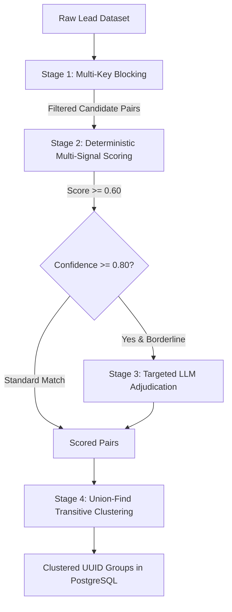

# Entity Resolution & Deduplication Pipeline Specification

This document provides a comprehensive technical breakdown of the 4-stage entity resolution and deduplication architecture implemented in `app/services/dedupe_service.py`.

---

## 1. Problem Definition & Algorithmic Challenge

In enterprise CRM systems, contact records arrive with spelling inaccuracies, inconsistent phone formats, corporate legal suffix variations (`Pte Ltd` vs `& Co`), and abbreviated names. 

Comparing every record against every other record requires an all-pairs pairwise comparison matrix:
$$\text{Comparisons} = \frac{N(N - 1)}{2}$$

For $N = 2,000$ leads, this represents $\approx 2,000,000$ candidate pairs. Evaluating each pair with heavy fuzzy matching or external Large Language Model (LLM) APIs would introduce unacceptable latency and high inference costs.

To solve this, WizzAI implements a **4-Stage Entity Resolution Pipeline**:



---

## 2. Stage 1: Multi-Key Inverted Index Blocking

Blocking drastically shrinks the candidate search space by partitioning leads into overlapping buckets based on cheap, high-recall deterministic keys. Two leads are considered a candidate pair **if and only if** they share at least one blocking key.

### Blocking Keys Generated per Lead (`generate_blocking_keys`):

1. **Exact Email (`email_exact`)**:
   - Normalized lowercase email string: `jane.doe@acme.com`
2. **Normalized Phone (`phone_normalized`)**:
   - Digits-only string with non-digits removed: `+1 (323) 555-0192` $\to$ `13235550192`
   - **Phone Suffix (`phone_suffix_10`)**: Last 10 digits to reconcile varying country code prefixes.
3. **Domain + Last Name (`domain_lastname`)**:
   - Email domain combined with first 3 characters of last name: `acme.com|kap`
4. **Normalized Company + First Name (`company_firstname`)**:
   - Company name stripped of legal suffixes, sorted by word, plus first 3 characters of first name: `acme|jan`

### Large Bucket Safety Filter:
Any blocking bucket containing $> 50$ leads is classified as noisy (e.g. generic domains like `gmail.com` or generic company names) and skipped to prevent combinatorial pair explosions.

---

## 3. Stage 2: Pairwise Multi-Signal Scoring

Candidate pairs generated from Stage 1 undergo weighted, multi-attribute evaluation across 5 independent signals.

$$\text{Confidence} = \sum_{k \in \text{Signals}} W_k \cdot S_k$$

### Calibrated Weight Matrix:

| Signal ($k$) | Weight ($W_k$) | Evaluation Metric & Logic |
|---|---|---|
| **Email** | **0.35** | `1.0` for exact match; `0.7` for identical domain with high localpart similarity ($\ge 0.8$ Jaro-Winkler); `0.3` for same domain only; `0.0` otherwise. |
| **Phone** | **0.25** | `1.0` for exact normalized digits; `0.8` for last 10 digits match; `0.0` otherwise. |
| **Name** | **0.20** | Jaro-Winkler similarity on `full_name`. Bonus matching for initials (e.g. `J. Diallo` vs `Joon Diallo` $\to 0.6$). |
| **Company** | **0.15** | Jaro-Winkler similarity on legal-suffix-stripped tokens plus word set overlap calculation. |
| **Notes Hint** | **0.05** | `1.0` if free-text notes explicitly contain phrases such as `"possible duplicate"`. |

Candidate pairs with $\text{Confidence} < 0.60$ (`DEDUPE_CONFIDENCE_THRESHOLD`) are eliminated.

---

## 4. False-Positive Defense Guarantee

A critical vulnerability in naive deduplication engines is the erroneous merging of distinct colleagues working at the same company who share similar names (e.g., *Arun Kapoor* vs *Arjun Kapoor* at *Kapoor Holdings*).

### Mathematical Guarantee:
Consider two colleagues:
- Company matches perfectly: $S_{\text{company}} = 1.0 \implies 0.15 \times 1.0 = 0.15$
- Names are superficially similar: $S_{\text{name}} \approx 0.80 \implies 0.20 \times 0.80 = 0.16$
- Email localparts differ: $S_{\text{email}} = 0.30$ (same domain only) $\implies 0.35 \times 0.30 = 0.105$
- Phones are distinct: $S_{\text{phone}} = 0.0$
- Notes have no hint: $S_{\text{notes}} = 0.0$

$$\text{Total Score} = 0.15 + 0.16 + 0.105 + 0 + 0 = 0.415$$

Because $0.415 < 0.60$, the pair is safely rejected. **Company identity alone can never overpower individual identity signals.**

This protection is validated in automated tests:
- `test_false_positive_same_company_similar_name`
- `test_false_positive_same_company_different_first_name`

---

## 5. Stage 3: Selective LLM Verification

To minimize inference costs while maintaining high precision on borderline duplicates, the Google Gemini 3.6 Flash API is called **strictly on an as-needed basis**:
- Triggered only when $\text{Confidence} \ge 0.80$ (`DEDUPE_LLM_THRESHOLD`).
- Capped at a maximum of 5 pairs per run (`DEDUPE_LLM_MAX_PAIRS`) to conserve free-tier API quotas.
- Implements response caching: previously verified pairs are cached locally across pipeline executions.

### Prompt Structure:
```text
Analyze these two CRM lead records and determine if they represent the same person.
Respond ONLY with a JSON object.

Lead A: {full_name, email, phone_number, company_name, job_title, notes}
Lead B: {full_name, email, phone_number, company_name, job_title, notes}

Response format:
{"is_duplicate": true/false, "confidence": 0.0-1.0, "explanation": "brief explanation"}
```

If LLM verification succeeds, the qualitative explanation is appended to the pair's audit trail:
`"Exact email match (isabelle@kapoor.com) | LLM: Confirmed identical executive relocating regional offices"`.

---

## 6. Stage 4: Transitive Graph Clustering (Union-Find)

Deduplication relations are inherently transitive:
$$\text{If } A \sim B \text{ and } B \sim C \implies A, B, C \text{ belong to the same entity cluster.}$$

The pipeline utilizes a **Disjoint-Set (Union-Find)** data structure with two key optimizations:
1. **Path Compression**: Flattens trees during `find()` operations, bringing amortized lookup time to nearly $O(1)$.
2. **Union by Rank**: Always attaches the smaller tree under the root of the deeper tree during `union()` operations.

### Cluster Assignment:
- All connected components with $>1$ member are grouped.
- A stable UUID `group_id` is assigned to the cluster root.
- The `dedup_group_id` column on each matching `Lead` record in the database is updated.
- Records in `dedupe_candidates` are tagged with the corresponding `group_id`.

---

## 7. Real-Time Ingestion Alignment (`find_best_match`)

When inbound forms arrive via `POST /api/leads/ingest`, the engine does not re-run the full $O(N)$ batch pipeline. Instead, it executes targeted resolution using `find_best_match`:
1. Constructs a transient `Lead` object from the inbound payload.
2. Extracts blocking keys for the new submission.
3. Retrieves only existing leads matching those keys.
4. Scores the transient lead against the candidate subset.
5. If the highest score meets or exceeds $0.60$, the submission updates the existing lead record.
6. Otherwise, a new lead record is created.
